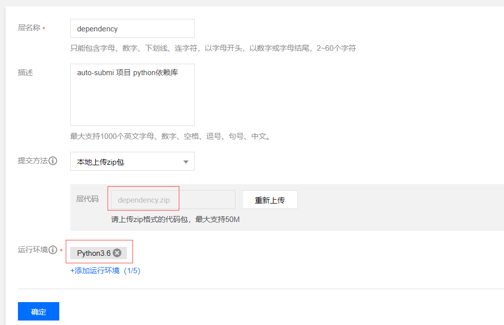
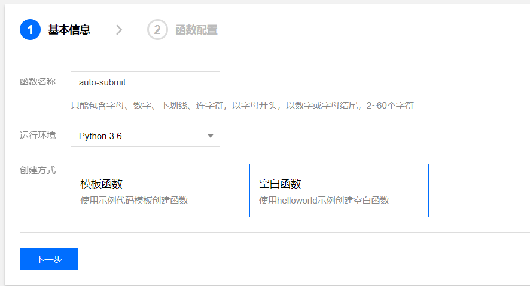
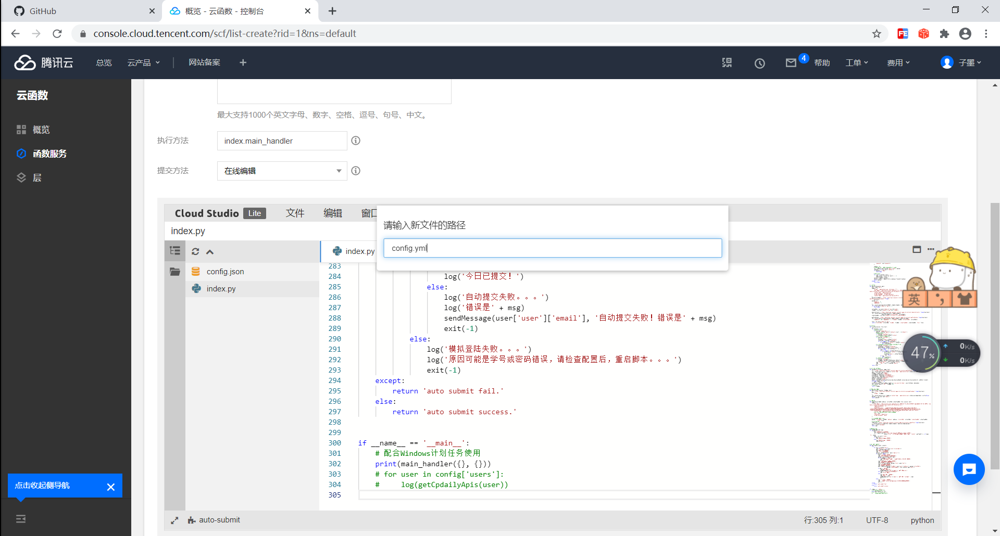

# cpdaily_submit
  hfut特供 今日校园 自动提交每日打卡

## 说明
  Fork from [liujilong0116](https://github.com/liujilong0116/cpdaily_submit)、[ZimoLoveShuang/auto-submit](https://github.com/ZimoLoveShuang/auto-submit)

> 同时申明，该项目自用于学习交流，不可用于商业用途，若侵权请联系我删除。

## 需修改处
* **(今日校园账户配置)config.yml:**
    * users中的--user按照注释修改好信息
    * cpdaily中的defaults为每天的打卡的问题。type为题目的类型：1为直接赋值的文本类型，2为单选，3为多选。若需要提交图片，参照子墨大佬的代码加个type：4
  

* **(打卡成功邮箱提醒)cpdaily_submit:**
    * 在代码的44-51行，为邮箱设置。若想加入邮箱提示功能，则可进行一下编辑，不需则跳过
    * 此处我使用的是163邮箱，mail_user填入邮箱名称，mail_pass填入授权码（[获取方法](https://jingyan.baidu.com/article/adc815139f60c2f723bf7385.html) ，目前163邮箱界面有点改变，但获取授权码的方式不变），sender填入邮箱号

## 使用方法
  
* **云端系统运行**
1. 打开百度搜索[腾讯云函数](https://console.cloud.tencent.com/scf/index?rid=1)，注册认证后，进入控制台，点击左边的  层，然后点新建，名称随意，然后点击上传zip，选择release中的`dependency.zip`上传，然后选择运行环境`python3.6`，然后点击确定，耐心等待一下，上传依赖包需要花费的时间比较长
  
2. 点左边的函数服务，新建云函数，名称随意，运行环境选择`python3.6`，创建方式选择空白函数，然后点击下一步

3. 提交方法选择在线编辑，把本地修改好的`index.py`直接全文复制粘贴到云函数的`index.py`，然后点击文件->新建，文件名命名为`config.yml`，然后把本地配置好的`config.yml`文件中的内容直接全文复制粘贴到云函数的`config.yml`文件，点击下面的高级设置，设置超时时间为`60秒`，**添加层为刚刚新建的函数依赖层**，然后点击完成

4. 进入新建好的云函数，左边点击触发管理，点击创建触发器，名称随意，触发周期选择自定义，然后配置cron表达式，下面的表达式表示每天晚上8：10分执行
    ```shell script
   0 10 20 * * * *
    ```
**最后建议大家尽量修改不同的触发时间，不要扎堆打卡，这样比较利于长久发展**

## 其他
觉得好用的话请给 [liujilong0116](https://github.com/liujilong0116/cpdaily_submit)、[ZimoLoveShuang/auto-submit](https://github.com/ZimoLoveShuang/auto-submit) 给个star/fork